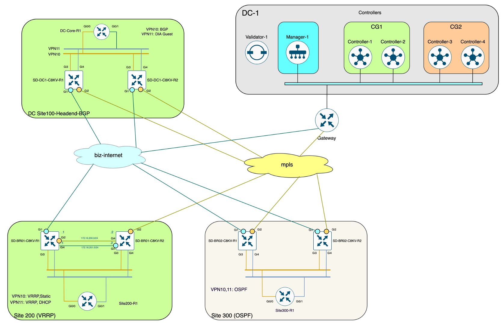
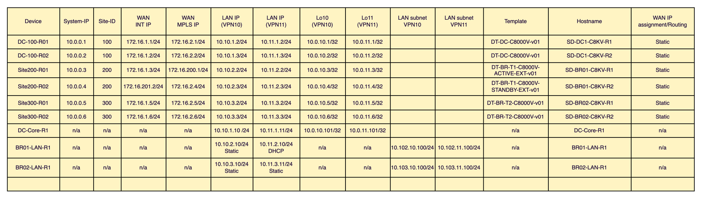

[](https://www.terraform.io)

# Network-as-Code SD-WAN Terraform

Use Terraform to operate and manage SD-WAN infrastructure using purpose built modules.

## Setup

Install [Terraform](https://www.terraform.io/downloads) (> 1.3.0), and the following Python tools:

- [iac-validate](https://github.com/netascode/iac-validate)

```shell
pip install iac-validate
```

Set environment variables pointing to vManage:

```shell
export SDWAN_USERNAME=admin
export SDWAN_PASSWORD=cisco123
export SDWAN_URL=https://10.1.1.1
```

Encrypted secrets (`$CRYPT_CLUSTER$...`) might have to be updated. Example data model from this repository can be initially deployed as-is, however it is recommended that all parameters in the feature templates that include vManage-encrypted strings (values that start with `$CRYPT_CLUSTER$`) to be updated with encrypted strings generated in the target vManage. 
Parameters with hash values (parameters that start with `$6$`, SHA512 hash, `$9$`, Cisco Type-9 hash, or Cisco Type-7 hash) should also be updated to use the desired clear-text value.

Installing dependencies and running the script to generate hash values and encrypted strings:

```
cd ~/scripts/python
pip install -r requirements.txt
python3 sdwan-encrypt-string.py <clear-text-string>
```
Output example:
```
nac-sdwan-example-cml-demo# python3 scripts/python/sdwan-encrypt-string.py cisco123
INFO:sdwan-encrypt:*** Connecting to the vManage API... ***
INFO:catalystwan.session:Logged to vManage(20.12.4) as vManageAuth(username=admin). The session type is SessionType.SINGLE_TENANT
INFO:sdwan-encrypt:Input clear-text string: cisco123
INFO:sdwan-encrypt:vManage-encrypted string: $CRYPT_CLUSTER$zTqrk5ZaF6CdQYPiC5ulOQ==$LOtd207JWpe24MOFmmYVxA==
INFO:sdwan-encrypt:SHA512 hash: $6$rpNV0XuwWrqw6C2e$5BerhYyj6kRDfxueby4jzRW64Btpc8iR1y0RROnpOyBJqifBHh.1Is3eyUtSLeooxvc5uy0PLnXa3aVrZd0k30
INFO:sdwan-encrypt:Cisco Type 7 hash: 14141b180f0b7b7977
INFO:sdwan-encrypt:Cisco Type 9 hash: $9$ykvnsmAx52JEgZ$.1vi1Ux6N/ypV26AQB4FF.IRgJMfUphKAs4bArHAXKQ
```

## Initialization

```shell
terraform init
```

This command will download all the required providers and modules from the public Terraform Registry ([https://registry.terraform.io](https://registry.terraform.io)).

## Pre-Change Validation

```shell
iac-validate data/
```

This command performs syntactic and semantic validation of YAML input files located in `data/`.

Data model structure:

```sh
|-- data
|   |-- centralized_policies.nac.yaml     # Centralized policy and definitions: Control policy, AAR, Data policy (UX 1.0)
|   |-- edge_device_templates.nac.yaml    # Device template definitions (UX 1.0)
|   |-- edge_feature_templates.nac.yaml   # Feature template definitions (UX 1.0)
|   |-- configuration_groups.nac.yaml     # Configuration groups definitions (UX 2.0)
|   |-- feature_profiles.nac.yaml         # Feature profiles definitions (UX 2.0)
|   |-- localized_policies.nac.yaml       # Localized policies definitions with components (route-policies, ACL, QoS) (UX 1.0)
|   |-- policy_objects.nac.yaml           # Policy objects (UX 1.0)
|   |-- sites_ux1.nac.yaml                # Sites data for UX 1.0 (Device Templates) for all 3 sites
|   |-- sites_ux2.nac.yaml                # Sites data for UX 2.0 (Configuration Groups) for all 3 sites
```

**Initial Site Configuration Mapping:**

```
sites_ux1.yaml:                              sites_ux2.yaml:
  • Site 100: # Commented (using UX 2.0)      • Site 100: ✓ Active
  • Site 200: # Commented (using UX 2.0)      • Site 200: ✓ Active  
  • Site 300: ✓ Active                        • Site 300: # Commented (using UX 1.0)
```

**Minimum SW release version for UX2.0 data model configuration deployment is 20.15**

## Terraform Plan/Apply

```shell
terraform apply
```

This command will apply/deploy the desired configuration.

## Testing

```shell
iac-test --data ./data --data ./defaults.yaml --templates ./tests/templates --filters ./tests/filters --output ./tests/results
```
* All data YAML files (```--data```) will be first combined into single data structure provided as input to templating process
* Each template  in the ```--templates``` will be rendered and written to the output folder, keeping the folder structure
* After all templates have been rendered Pabot will execute all test suites in parallel and create a test report in the  ```--output``` path.
* ```--filters``` DIRECTORY Path to Jinja filters. Custom Jinja filters can be used by providing a set of Python classes where each filter is implemented as a separate Filter class in a .py file located in the --filters path. 

This command will render and execute a set of tests and provide the results in a report (`tests/results/report.html`).

## Terraform Destroy

```shell
terraform destroy
```

This command will delete all the previously created configuration.

## CML SD-WAN Topology



CML backup files for this topology (and 3 nodes version) can be found in the nac-lab repository:

- [nac-lab sdwan topology large-20.15 (6 nodes)](https://wwwin-github.cisco.com/netascode/nac-lab/tree/master/modules/sdwan/templates)
- [nac-lab sdwan topology standard-20.15 (3 nodes)](https://wwwin-github.cisco.com/netascode/nac-lab/tree/master/modules/sdwan/templates)

Target topology can be deployed from backup in CML with [Catalyst SD-WAN Lab Deployment Tool](https://github.com/cisco-open/sdwan-lab-deployment-tool)

## Topology details


